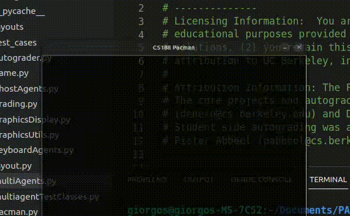

# Pacman AI



## Description
This project implements various AI algorithms that attempt to play the classic Pacman game, based on Berkeley's Intro to AI course (CS188). The algorithms featured are:
- Reflex Agent algorithm
- Minimax algorithm
- Alpha-Beta Pruning algorithm
- Expectimax Algorithm

The 4 algorithms are implemented in `/multiagent/multiAgents.py`.

## Instructions
To run on a graphical environment using a specific agent, first select the argument for each agent:
- `ReflexAgent`
- `MinimaxAgent`
- `AlphaBetaAgent`
- `ExpectimaxAgent`

And run:
```
python pacman.py -p <AGENT>
```
To run the full evaluation:
```
python autograder.py
```
To grade on a specific test (list of tests for each question: `/multiagent/test_cases`):
```
python autograder.py -t test_cases/<QUESTION>/<TEST>
```
BONUS To play a good, old-fashioned game of packman:
```
python pacman.py
```

## Acknowledgment
This project is based on the material provided by Berkeley's Intro to AI course (CS188), which is available  at http://ai.berkeley.edu/home.html
